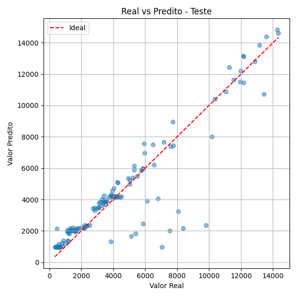
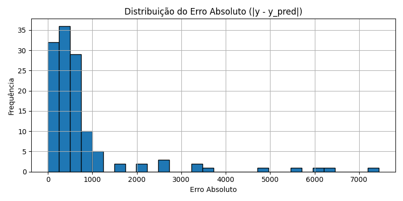
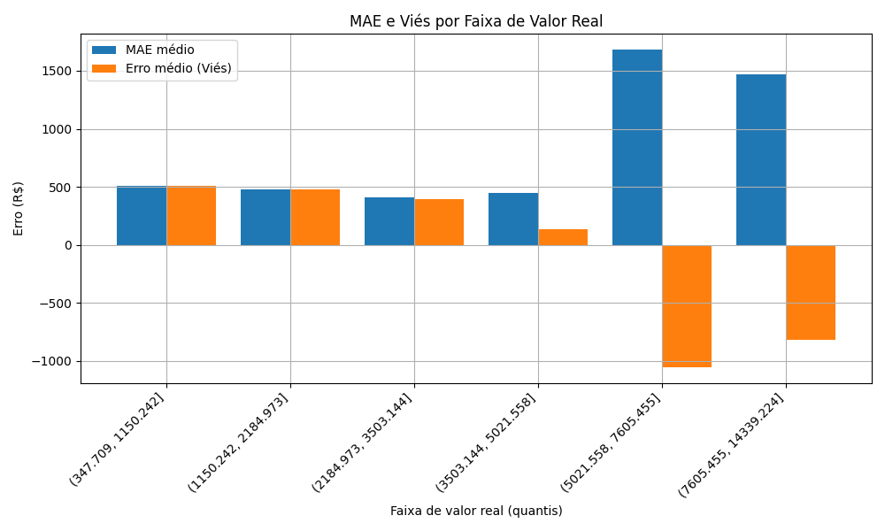
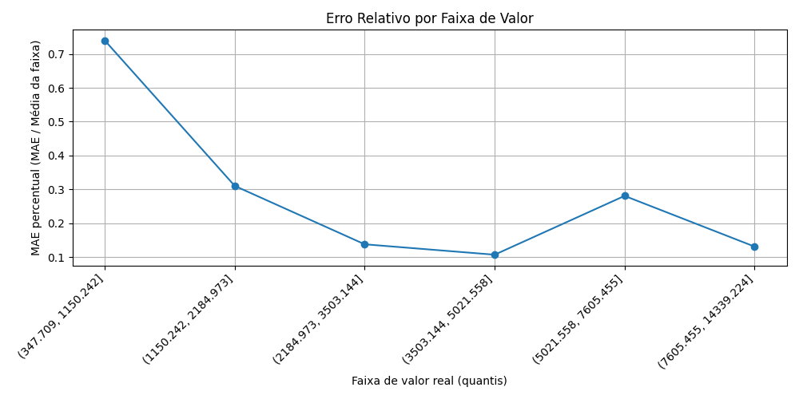
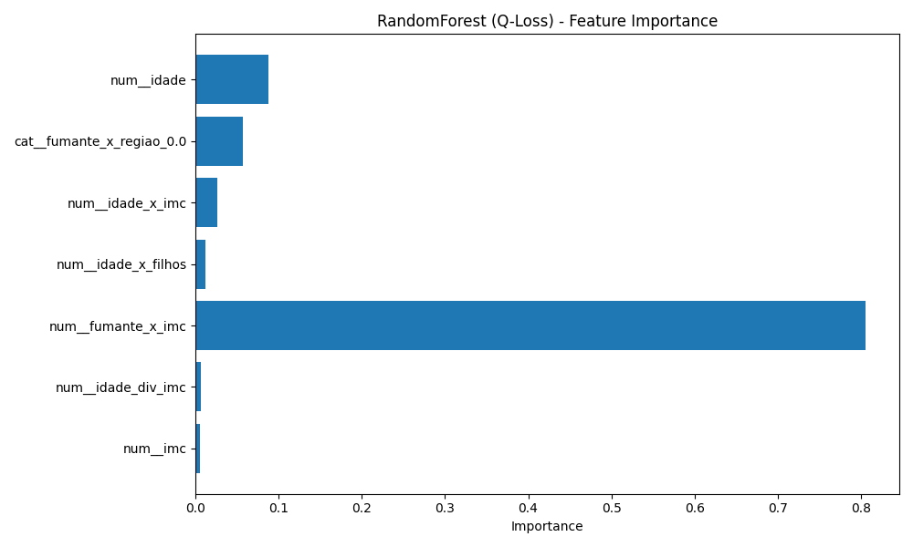

# Previsão de Gastos com Plano de Saúde

Este projeto visa prever o valor **gasto anualmente por clientes de um plano de saúde**, com modelos que **penalizam o erro de subestimar os gatos**, uma escolha estratégica para **evitar prejuízos por provisionamento insuficiente**.

## Ambiente Virtual

1. Crie o ambiente virtual:

```bash
python -m venv .venv
```

2. Ative o ambiente:

- Windows:
```bash
.venv\Scripts\activate
```
- Linux/macOS:
```bash
source .venv/bin/activate
```

3. Instale as dependências:

```bash
pip install -r requirements.txt
```

---

## Notebooks do Projeto

### 1. `eda.ipynb`
Análise exploratória dos dados com foco em:
- Distribuições de variáveis numéricas e categóricas
- Correlações e relações com a variável alvo
- Regras extraídas com o algoritmo Apriori (maiores lifts)
- Geração de gráficos para entendimento de comportamento por faixas de valor
- Gráficos em `plots/`

### 2. `feature_engineering.ipynb`
Engenharia de novas variáveis:
- Combinações entre variáveis numéricas (ex: `idade * imc`, `idade / imc`)
- Interações entre binárias e categóricas (ex: `fumante x região`)
- Interpretação de significado de interações para o negócio

### 3. `data_prep.ipynb`
Pipeline de pré-processamento com:
- Imputação (mediana para numéricas, mais frequente para categóricas)
- Padronização de variáveis numéricas
- OneHotEncoding com tratamento específico para variáveis binárias
- Criação e salvamento do pipeline completo
- Gera artefato:
  - `artifacts/pipeline_completo.pkl`: pipeline salvo com prepare_data

### 4. `feature_selection.ipynb`
Seleção de variáveis em três etapas:
- BorutaPy com Random Forest (selecionou 5 variáveis)
- Importância de features com RandomForest
- Análise de multicolinearidade (VIF) para identificar e remover redundâncias
- Gera gráficos de importância e multicolinearidade em `plots/`
- Como artefato um csv com a seleçao do Boruta em `artifacts/`

Dessa forma, foram criados dois datasets:
- Um com todas as variáveis para modelos robustos à multicolinearidade
- Um sem as altamente correlacionadas para modelos sensíveis

### 5. `trainning_and_testing.ipynb`
Treinamento, validação e avaliação:
- Modelos robustos: RandomForest, CatBoost, LightGBM, XGBoost, HistGradientBoosting
- Modelos sensíveis: LinearRegression, Ridge, Lasso
- Escolha do modelo campeão: RandomForest (otimizado com Optuna para MAE e Q-Loss)
- Artefatos:
    - `artifacts/modelo_final_catboost.pkl`
    - `artifacts/best_catboost_params.json`

Avaliação com métricas:
- Quantile Loss (Q=0.8)
- MAE, MAPE, Bias e % Subestimações
- Análises gráficas:
  - Real vs Predito
  - Distribuição do erro absoluto
  - MAE por faixa de valor
  - Viés por faixa de valor
  - MAE percentual por faixa de valor

---

## Modelo Campeão

**RandomForestRegressor**, otimizado com busca bayesiana (Optuna), apresentou:

- Quantile Loss: ~430
- MAE: ~830
- MAPE: ~31%
- Viés: ~ -53 (ligeira tendência a subestimar)
- % Subestimado: ~22%

### Avaliação Visual do Modelo

#### 1. Real vs Predito


#### 2. Distribuição do Erro Absoluto


#### 3. MAE e Viés por Faixa de Valor


#### 4. MAE Percentual por Faixa de Valor


#### 5. Importância das Variáveis



**Interpretação de negócio**:
- O modelo tem bom desempenho preditivo com tendência controlada de subestimação
- Erro relativo mais alto em faixas mais baixas de valor, mas mais seguro nas faixas elevadas (críticas para provisionamento)
- Feature importance coerente com variáveis combinadas como `fumante x imc`

---

## Conclusão

O modelo final mostra desempenho consistente, com erros aceitáveis frente ao objetivo de negócio. Com base em:
- Estratégia de modelagem robusta
- Métricas ajustadas ao risco de subestimar
- Interpretação dos resultados por faixa de valor

A solução proposta é viável para uso em contexto real, com oportunidades de evolução com mais dados ou novos atributos comportamentais.

---

## Próximos Passos

- Expandir o conjunto de variáveis com dados externos
- Agrupar clientes em segmentos e treinar modelos especializados
- Analisar outliers e incorporar flags de atipicidade
---